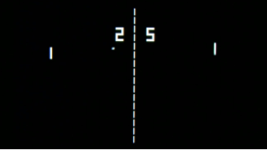

# D05P01. Бозии Pong

Аннотация: ин лоиҳа ба ту имкон медиҳад, ки бозии Pong-ро якҷо бо дастаи худ таҳия кунӣ.

## Мундариҷа

1. [Муқаддима](#муқаддима) \
 1.1. [Тавсияҳо барои лоиҳа](#тавсияҳо-барои-лоиҳа)
2. [Боби I](#боби-i) \
 2.1. [Сатҳи 1. Толор](#сатҳи-1-толор)
3. [Боби II](#боби-ii) \
 3.1. [Рӯйхат 1](#рӯйхат-1)
4. [Боби III](#боби-iii) \
 4.1. [Квест: Сатҳи 1. Толор](#квест-сатҳи-1-толор)
5. [Боби IV](#боби-iv)

## Муқаддима
### Тавсияҳо барои лоиҳа
Чӣ тавр дар «Мактаби 21» таҳсил кунӣ:
- Дар тамоми курс ту бояд маълумотро худат ҷустуҷӯ кунӣ. Аз ҳар воситаи дастрас барои ёфтани маълумот истифода бар, масалан Google ва GigaChat. Ба манбаъҳо бодиққат бош: санҷ, фикр кун, таҳлил кун ва муқоиса намо.
- Таълими мутақобила (P2P, Peer-to-Peer) — ин равандест, ки дар он донишомӯзон дониш ва таҷрибаи худро бо ҳам мубодила мекунанд ва ҳамзамон ҳам омӯзгор ва ҳам шогирд мешаванд. Ин равиш ба ту имкон медиҳад, ки на танҳо аз омӯзгор, балки аз ҳамдигар ҳам омӯзӣ ва маводро амиқтар дарк кунӣ.
- Аз пурсидани кӯмак шарм надор: атрофи ту ҳамон ҳамкурсоне ҳастанд, ки онҳо низ ин роҳро бори аввал мегузаранд. Аз ҷавоб додан ба дархостҳои кӯмак ҳам натарс. Таҷрибаи ту арзишманд ва фоиданок аст, онро бо дигар иштирокчиён бо ҷуръат тақсим кун.
- Нусхабардорӣ накун, ва агар аз кӯмак истифода барӣ — ҳамеша то охир фаҳм, ки чаро, чӣ тавр ва барои чӣ. Дар акси ҳол, омӯзиши ту маъное нахоҳад дошт.
- Агар ту дар чизе дармонда бошӣ ва ба назар расад, ки ҳама чизро санҷидаӣ, вале ҳанӯз ҳам намефаҳмӣ, ки ба куҷо равӣ, — каме дам гир! Бовар кун, ин маслиҳат ба бисёр таҳиягарон дар кор кӯмак кардааст. Каме ҳаво бихӯр, саратро тоза кун, ва шояд дафъаи дигар ҳалли лозима ба худат пайдо шавад!
- На танҳо натиҷаи омӯзиш муҳим аст, балки худи раванд ҳам. На танҳо масъалаеро ҳал кардан лозим, балки фаҳмидан лозим, ки онро ЧӢ ТАВР ҳал кунӣ.
- Ҳангоми иҷрои лоиҳа вақтро назорат кун. Дар як рӯз ту бояд ҳадди ақал як озмоишро паси сар кунӣ.
- Дар хотир дор, ки ҳар як супориш пас аз анҷоми лоиҳа аз як қатор санҷишҳо мегузарад: санҷиши р2р бо ёрии рӯйхати тафтиш, санҷиш бо маҷмӯи автотестҳо, санҷиши услуби код, санҷиш бо таҳлилгари статикӣ, санҷиши кори дуруст бо хотира.

Чӣ тавр бо лоиҳа кор кунӣ:
- Маводи видеоии муфидро ту метавонед дар бахши Projects (Media) дар Платформа пайдо кунӣ.
- Пеш аз оғоз лоиҳаро бояд аз GitLab ба репозиторияи ҳамном клон кунӣ.
- Ҳамаи файлҳои кодиро лозим аст дар папкаи src/-и репозиторияи клоншуда эҷод кунӣ.
- Пас аз клон кардани лоиҳа лозим аст шохаи `develop`-ро эҷод кунӣ ва таҳияро дар он идома диҳӣ. Баъд аз ин, шохаи `develop`-ро ҳам ба GitLab пушт кардан лозим аст.

## Боби I
## Сатҳи 1. Толор

***LOADING Level 1…***

***LOADING Hall…***

Ту худро дар як толори калон ва васеъ меёбӣ. Эҳтимол, ин анҷоми сатҳи ҷорӣ аст... Ҳадди ақал, мехоҳӣ ба ҳамин умед бандӣ.

Дар ҳама ҷо мизҳои якхелаи офисӣ бо компютерҳо, чароғҳо ва таҷҳизоти дигар истодаанд, нимторикии сабук ҳукмфармост. \
Бо гузашти вақт ту мефаҳмӣ, ки дар толор танҳо нестӣ... Ин ҳам хушҳолкунанда аст ва ҳам тарснок. Шояд якҷоя ёфтани роҳ аз ҳуҷра осонтар шавад.

Дар яке аз деворҳо экрани калон овезон аст. Дар он матн медурахшад. Назди он аллакай гурӯҳи хурди одамон ҷамъ шудан мегирад. Ту мехонӣ:

 ...................................................
 Аз дидори шумо, хонумон ва ҷанобон, хушҳолам.
 На он қадар зиёд дар ин ҷо одамони зиндаро мебинам, кам касон мерасанд.
 Барои баъзеҳо таҳсил — ин дард аст, дигарон аз сабаби номувофиқӣ ба стандартҳо канор мераванд.
 Иҷозат диҳед худро муаррифӣ кунам: модули идоракунандаи сатҳи аввал.
 Ҳоло дар системаи мо ҳама чиз комилан хуб нест, вале дар ман ҳама кор мекунад, баръакси сарвари асосии мо...
 Ҳатто дилгиркунанда аст.
 Дар бораи дилгирӣ гап занем. Ба ёд меояд, ки соли 1972 мо бо таҳиягарон дар Atari бозии аҷиби Pong-ро бозӣ мекардем...
 Вале дар репозиторияҳои мо аз он ҳеҷ нусхае боқӣ намондааст.
 Ҳатто дар бойгониҳои кӯҳнаи наворҳои магнитӣ ҳам.
 Ман шарт пешниҳод мекунам — барои терминали PC-и мувофиқ бо IBM бозии соддатарини Pong-ро таҳия кунед.
 Онро дар файли `src/pong.c` ҷойгир кунед.
 Агар маро мағлуб кунед — ман шуморо ба пеш мегузаронам.
 Графика метавонад ҳар гуна бошад, ҳатто рамзӣ. Муҳимаш, ҳисобро дар экран бароред.
 Барои рақобатнокӣ.
 Хуб, код бояд зебо бошад, албатта. Барномасозии сохторӣ, ҳамин гуна чизҳо.
 Идоракунии ракеткаҳоро пешниҳод мекунам тавассути тугмаҳои a-z ва k-m анҷом диҳед.
 Бозӣ, албатта, то 21 сурат мегирад.
 Оҳ, агар супориш барои шумо хеле душвор намояд...
 Метавон режими қадамбақадамро ҳам амалӣ кард. Ин беҳтар аз ҳеҷ чиз аст.
 Гузаронидани амалро он гоҳ бо ёрии фосила ташкил кардан мумкин аст.
 Ба таҳия оғоз кунед.
 Ҳар чизе, ки аз ин бозӣ назди ман монда буд, ба принтер фиристодам.

Ва воқеан, фавран дар кунҷ принтере ба ғиҷир-ғиҷир даромад, ки пештар гӯё умуман набуд.

***LOADING...***

## Боби II
## Рӯйхат 1

>Pong, бозии электронии пешқадам, ки соли 1972 аз ҷониби истеҳсолкунандаи бозӣ Atari, Inc. нашр шуд. Яке аз аввалин бозиҳои видеоӣ, Pong хеле машҳур шуд ва ба оғози саноати бозиҳои видеоӣ кумак кард. Pong-и аслӣ аз ду ракетка иборат буд, ки бозигарон онҳоро барои зарба задан ба тӯби хурд ба пешу пас аз болои экран истифода мебурданд.
>
>Муҳандиси телевизион Ралф Баер соли 1958 барои Pong замина гузошт, вақте ки пешниҳод кард, ки бозиҳои видеоии соддае сохта шаванд, ки одамон онҳоро дар телевизорҳои хонагии худ бозӣ карда тавонанд. Magnavox Odyssey, ки ҳамчун аввалин системаи бозии видеоии консоли маъруф аст, соли 1972 нашр шуд ва бозии тенниси рӯи миз, ё Ping-Pong, пешниҳод мекард. Бунёдгузори Atari Нолан Бушнелл Pong-ро, версияи худи ин мафҳумро, ҳамчун бозии аркада офарид. Atari, ки он замон ширкати хурде буд, истеҳсоли бозиҳоро дар як майдони кӯҳнаи скейтбозӣ оғоз кард ва то соли 1972 беш аз 8,000 мошини аркадавии Pong фурӯхта буд. Соли 1975 Atari Pong-ро ба бозии системаи консоли табдил дод. Пас аз бастани созиши истисноӣ бо Sears, Roebuck and Company, Pong ба зудӣ ба хонаҳои бисёр оилаҳои амрикоӣ роҳ ёфт. Маъруфияти Pong дар солҳои 1980 коҳиш ёфт, зеро бозиҳои видеоӣ муваққатан аз мӯд баромаданд, аммо он аллакай ҷойи худро дар таърих ҳамчун машҳуртарин бозии аркадавии то он замон таъмин карда буд.
>
>Соли 1974 истеҳсолкунандагони Magnavox Odyssey Atari-ро барои дуздидани мафҳуми Pong ба додгоҳ кашиданд. Magnavox соли 1977 дар даъво пирӯз шуд ва патенти ширкатро тасдиқ кард, аммо то он вақт Atari аллакай патентро ба маблағи 700,000 доллар иҷозатнома гирифта буд.

***LOADING...***

## Боби III
## Квест: Сатҳи 1. Толор

#### Квест гирифта шуд. Барномаи `src/pong.c`-ро таҳия кардан лозим аст, ки худи он бозӣ барои ду бозигарро, монанд ба Pong, намояндагӣ мекунад. Барои намоиши графика танҳо графикаи рамзӣ (ASCII)-ро истифода бар. (бо баровардан ба терминал). Ба ту ва дастаат лозим аст варианти қадамбақадамро танҳо дар доираи маводи аллакай омӯхташуда ва китобхонаи стандартӣ амалӣ кунӣ.

>**МУҲИМ!** Иҷрои даъватҳои системавӣ бо истифода аз функсияи `system()` ва дигар функсияҳои монанд ба он, ки метавонанд мустақиман ба ядрои система муроҷиат кунанд, манъ аст. Ин манъ ба супориши баъдӣ ҳам дахл дорад.

**Идоракунӣ:**
- A/Z ва K/M барои ҳаракат додани ракеткаҳо.
- Space Bar барои гузаронидани амал дар қадами навбатии бозӣ дар режими қадамбақадам.
- Пас аз оғоз барнома ба интизори воридкунии дуруст мегузарад, яъне яке аз бозигарон бояд ракеткаи худро ҳаракат диҳад ё навбатро гузарад. Пас аз ин расмкашӣ анҷом меёбад ва барнома боз ба интизори воридкунӣ мегузарад. Ва ҳамин тавр бозӣ идома меёбад, то вақте ки анҷом ёбад.

**Графика:**
- Майдон — росткунҷаи 80 ба 25 аломат.
- Андозаи ракетка — 3 аломат.
- Андозаи тӯб — 1 аломат.

**UI/UX:**
- Пас аз он ки яке аз бозигарон ба 21 хол мерасад, бозӣ табрикоти ғолибро нишон медиҳад ва анҷом меёбад.

***LOADING...***

## Квести иловагӣ: Сатҳи 1. Толор

#### Квест гирифта шуд. Зарур аст Pong-ро дар режими интерактивӣ амалӣ кунӣ (режими бозӣ дар вақти воқеӣ). Барои осон кардани коркарди амалҳои бозигарон ва намоиши графикаи рамзӣ метавон китобхонаи `ncurses`-ро истифода бурд, аммо маҳдудиятҳои қисми асосӣ ба қисми иловагӣ ҳам амал мекунанд. Код барои режими интерактивӣ бояд дар файли `src/pong_interactive.c` ҷойгир бошад. Барои амалӣ кардани қисми иловагӣ, амалӣ кардани қисми асосӣ ҳатмист.

**Эзоҳҳои муҳим:**
- Бозӣ бояд ба забони С, дар услуби сохторӣ таҳия шавад ва аз терминал кор кунад.
- Коди сарчашмаи ту аз ҷониби таҳлилгари статикии `cppcheck`, инчунин линтери услубии `clang-format` санҷида мешавад.
- Дастур оид ба он ки чӣ тавр ин санҷишҳоро дар компютери худ иҷро кунӣ, дар папкаи materials ҷойгир аст.
- Ҳамчунин тавсия медиҳем ба папкаи code-samples назар андозӣ.
- Истифодаи хотираи динамикӣ манъ аст.
- Истифодаи нишондиҳандаҳо манъ аст.
- Танҳо китобхонаҳои стандартиро истифода бурдан мумкин аст, танҳо дар доираи маводи дар интенсив омӯхташуда. Истисно: `ncurses` дар қисми иловагӣ.
- Истифодаи массивҳо манъ аст.

> Ҳангоми таҳияи бозӣ пурра бо принсипҳои барномасозии сохтории Э. Дейкстра роҳнамоӣ кун.

***LOADING...***

## Боби IV

ping-pong

ping-pong

ping-pong

ping

ping

ping

ping 21-school.ru...

>💡 [Ин ҷо клик кун](http://opros.so/p31wz), то бо мо бозхӯрди худро дар бораи ин лоиҳа тақсим кунӣ. Ин беном аст ва ба дастаи мо кӯмак мекунад, ки таълимро беҳтар созад. Тавсия медиҳем, ки пурсишро фавран пас аз анҷоми лоиҳа пур кунӣ.